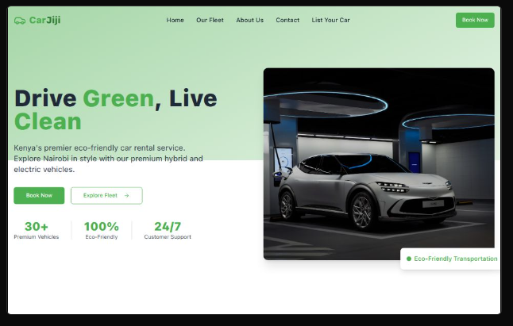

# Car Jiji

Car Jiji is Kenya's premier eco-friendly car rental marketplace, focused on providing sustainable mobility solutions through a curated fleet of hybrid and electric vehicles. The platform connects car owners with environmentally conscious renters, making it easy to rent or list eco-friendly cars in Nairobi and beyond.

---

## Project URL

https://carjijike.vercel.app/


---

## Project Preview




---

## 🚗 Project Aim

Car Jiji aims to:
- **Promote sustainable transportation** by making hybrid and electric vehicles accessible to more people.
- **Reduce carbon emissions** and support Kenya's green initiatives.
- **Empower car owners** to earn extra income by listing their eco-friendly vehicles.
- **Deliver a seamless, premium rental experience** for customers seeking comfort, style, and environmental responsibility.

---

## 🌱 How Car Jiji Works

### For Renters

1. **Browse Vehicles**  
   Explore a wide selection of vetted hybrid and electric vehicles on the [Our Fleet](src/pages/CarsPage.tsx) page. Each car listing provides details such as price, range, seating, and features.

2. **Book Instantly**  
   Use the [Booking Form](src/components/BookingForm.tsx) to select your preferred dates and vehicle. The booking process is simple and secure.

3. **Drive Green**  
   Pick up your car and enjoy a premium, eco-friendly driving experience in Nairobi.

---

### For Car Owners

1. **List Your Car**  
   Visit the [List Your Car](src/pages/ListYourCarPage.tsx) page and fill out the registration form with your vehicle's details. Only hybrid and electric vehicles are eligible.

2. **Get Vetted**  
   The Car Jiji team reviews each submission to ensure quality and compliance with platform standards.

3. **Earn Income**  
   Once approved, your car is listed on the platform. You earn money each time your vehicle is rented, with insurance and support provided.

---

## 🛠️ Features

- **Modern UI**: Built with React, Tailwind CSS, and Vite for a fast, responsive experience.
- **Advanced Search & Filters**: Easily find vehicles by type, price, seats, and more.
- **Secure Booking**: Simple, secure booking process for renters.
- **Owner Dashboard**: Car owners can manage their listings and track earnings (future enhancement).
- **Testimonials & Reviews**: Real feedback from customers and car owners.
- **Sustainability Focus**: Only hybrid and electric vehicles are accepted.

---

## 📦 Project Structure

. ├── public/ ├── src/ │ ├── components/ │ ├── hooks/ │ ├── lib/ │ ├── pages/ │ ├── App.tsx │ └── main.tsx ├── index.html ├── package.json └── README.md


- **Components**: Reusable UI elements (e.g., Navbar, Footer, CarCard, BookingForm).
- **Pages**: Main routes (Home, Cars, About, Contact, List Your Car).
- **UI**: Custom UI primitives and utilities.

---

## 🚀 Getting Started

1. **Install dependencies**
   ```sh
   npm install

2. **Run the development server**

npm run dev


## 🤝 Contributing

We appreciate your interest in Car Jiji! At this time, contributions are only accepted from approved collaborators. If you have suggestions or would like to partner with us, please contact the team directly.

---

## 📄 License

Car Jiji is a proprietary project. All rights reserved.  
No part of this project may be copied, distributed, or modified without explicit written permission from the project owner.


## 📞 Contact
For questions or support, visit the Contact Us page or email us at info@carjiji.co.ke.

Together, let's drive Kenya towards a greener, more sustainable future!

